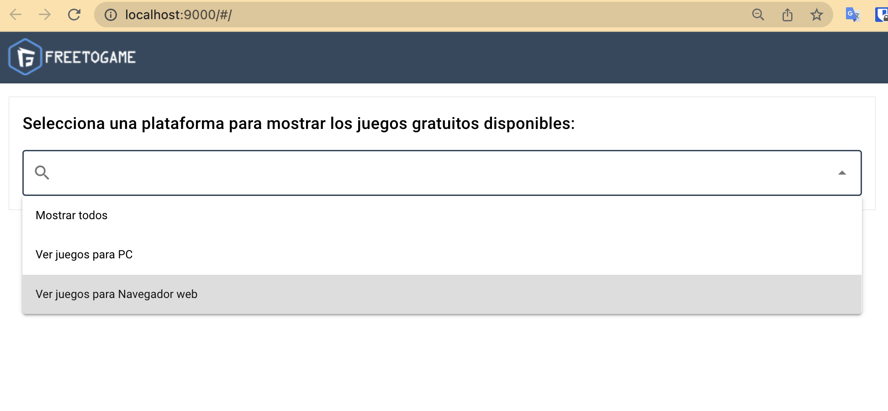

# prueba-frontend
Prueba de desarrollo de frontend en la que consultar juegos gratis filtrados por plataforma.

**Quasar** es un framework de Vue.js con el que podremos contruir y maquetar páginas web.

##REQUIREMENTS

    ·npm
    ·yarn
    ·nodejs 16.16.0
    ·quasar
    ·vue.js

**DEMO**
Página inicial:

Pagina propuesta:

#PROBLEMAS

A la hora de instalar y crear el entorno para trabajar no he tenido ningun problema.

Cuando he añadido la disposicion que se pedia en la prueba, no he podido centrar bien
el contenedor donde se listan los items y he tenido que ponerlos pegados por los lados
para que se viera centrado.

He agrandado la imagen para que se ajusten a la parte de arriba de la tarjeta de producto
y debajo he puesto la información. He añadido la desarrolladora para poner un poco mas de información.

Me gustaria haber añadido una tipografía sans-serif para el texto, pero he encontrado muchas dificultades
para añadirla.

